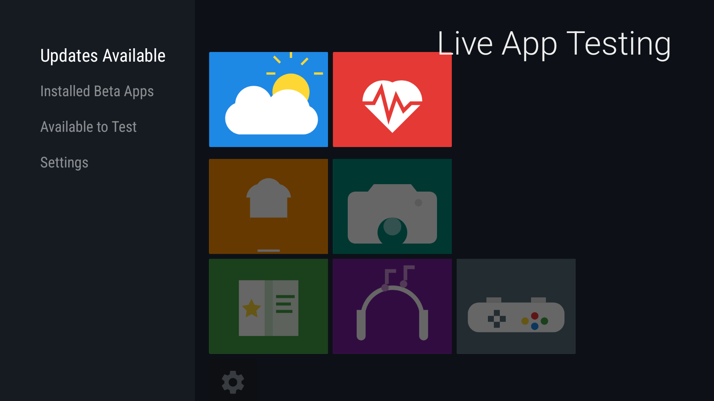
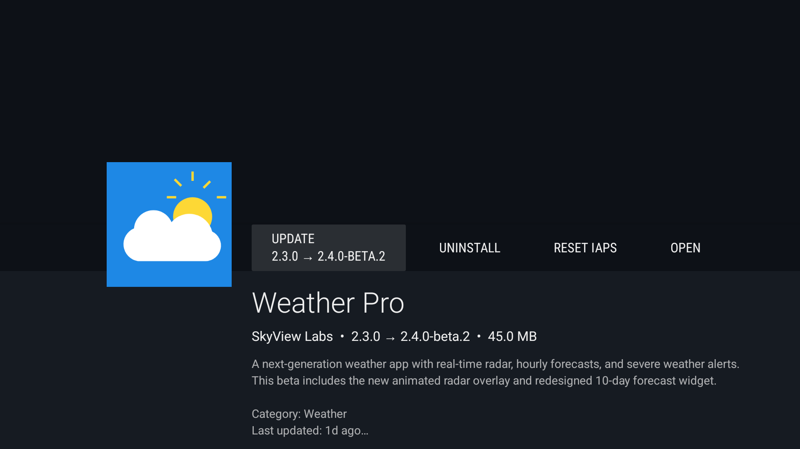
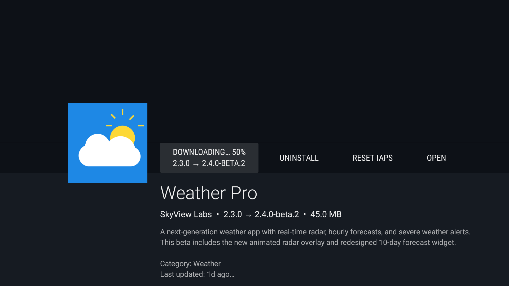
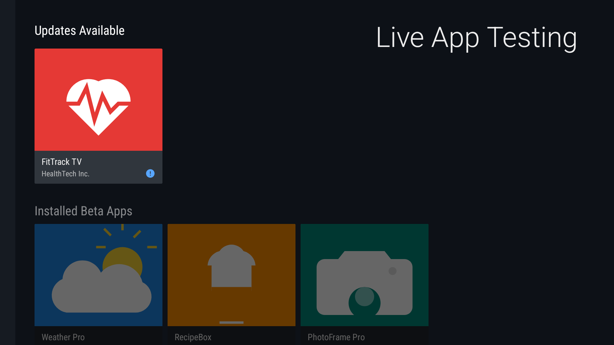
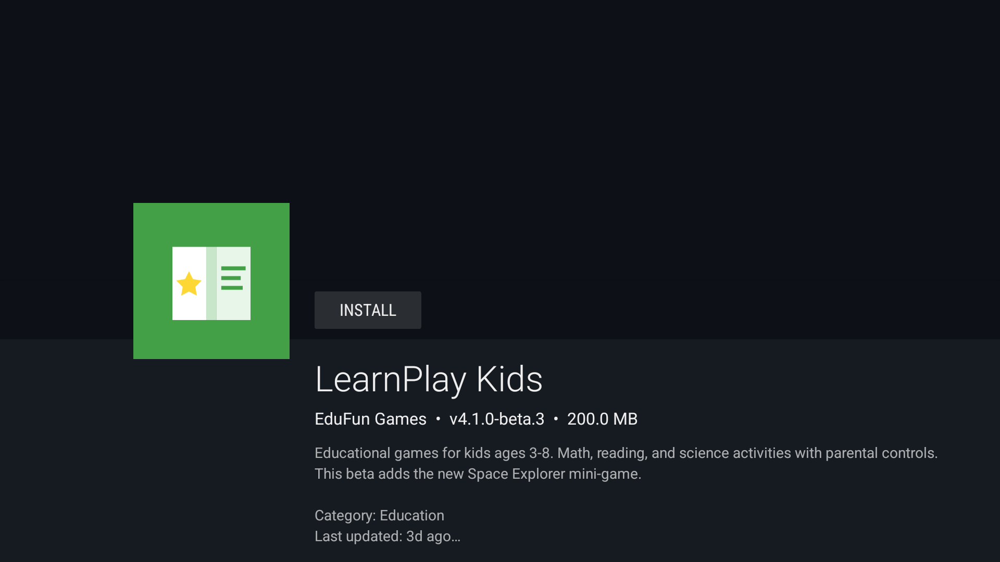

# Beta App Manager for Fire TV

A Fire TV application that enables 3P developers to manage their beta apps published through [Live App Testing (LAT)](https://developer.amazon.com/docs/app-testing/live-app-testing.html) on Amazon Appstore — directly from their Fire TV device.

## Screenshots

### Main Browse Screen
The home screen shows all beta apps organized into clear categories using the Leanback `BrowseSupportFragment`:



- **Updates Available** — Installed apps with a newer beta version ready
- **Installed Beta Apps** — Apps installed and fully up-to-date
- **Available to Test** — Invited but not yet installed on device
- **Settings** — Notification preferences and account info

### App Detail Screen (Update Available)
Shows app metadata, version info, and context-sensitive action buttons:



Actions available: **Update** (with version info), **Uninstall**, **Reset IAPs**, **Open**

### Download Progress
Real-time download progress shown inline on the action button:



### State Transitions
After updating Weather Pro, it moves from "Updates Available" to "Installed Beta Apps":



### App Detail Screen (Not Installed)
For apps not yet installed, only the **Install** button is shown:



---

## Architecture

```
MVVM + Repository + ServiceLocator

┌─────────────────────────────────────────────┐
│  UI Layer (Leanback Fragments + Presenters) │
│  MainFragment, AppDetailFragment, Settings  │
└────────────────────┬────────────────────────┘
                     │ observes LiveData
┌────────────────────▼────────────────────────┐
│  ViewModel Layer                            │
│  MainViewModel, AppDetailViewModel,         │
│  SettingsViewModel                          │
└────────────────────┬────────────────────────┘
                     │ calls suspend functions
┌────────────────────▼────────────────────────┐
│  Repository Layer (BetaAppRepository)       │
│  In-memory caching, row classification,     │
│  cache invalidation on state changes        │
└────────────────────┬────────────────────────┘
                     │ delegates to
┌────────────────────▼────────────────────────┐
│  API Layer (BetaAppService interface)       │
│  ┌─────────────────┐  ┌──────────────────┐  │
│  │ MockBetaApp     │  │ RealBetaApp      │  │
│  │ Service         │  │ Service (TODO)   │  │
│  └─────────────────┘  └──────────────────┘  │
│                                             │
│  AuthManager (LWA SSO)                      │
└─────────────────────────────────────────────┘

DI: ServiceLocator (flip useMockApi flag to switch)
```

### Key Design Decisions

| Decision | Choice | Rationale |
|---|---|---|
| UI Framework | Android Leanback | Native Fire TV look & feel, D-pad navigation built-in |
| Architecture | MVVM | Lifecycle-aware, testable, standard Android pattern |
| DI | ServiceLocator | Lightweight for this app size; no Dagger overhead |
| Async | Kotlin Coroutines + Flow | Download progress streaming, clean suspend APIs |
| Auth | Login with Amazon SSO | Users already signed into Amazon on Fire TV |

---

## Project Structure

```
app/src/main/java/com/amazon/lat/betamanager/
├── data/
│   ├── api/
│   │   ├── BetaAppService.kt          # API interface (fully documented)
│   │   ├── MockBetaAppService.kt       # Mock with 7 sample apps
│   │   └── AuthManager.kt             # LWA SSO auth (mock + real docs)
│   ├── model/
│   │   ├── BetaApp.kt                 # Core model + AppStatus enum
│   │   ├── AppUpdate.kt               # Update metadata
│   │   ├── DownloadState.kt           # Sealed class for progress
│   │   ├── IapItem.kt                 # IAP item + IapType enum
│   │   ├── NotificationPreference.kt  # Notification settings
│   │   └── UserProfile.kt             # User info from LWA
│   └── repository/
│       └── BetaAppRepository.kt       # Caching + row classification
├── di/
│   ├── ServiceLocator.kt              # DI root (mock/real toggle)
│   └── ViewModelFactory.kt            # ViewModel creation
├── ui/
│   ├── activity/
│   │   ├── MainActivity.kt            # Hosts browse fragment
│   │   ├── DetailActivity.kt          # Hosts detail fragment
│   │   └── SettingsActivity.kt        # Hosts settings fragment
│   ├── fragment/
│   │   ├── MainFragment.kt            # Browse screen with 4 rows
│   │   ├── AppDetailFragment.kt       # Detail with actions
│   │   └── SettingsFragment.kt        # Leanback preferences
│   └── presenter/
│       ├── AppCardPresenter.kt         # Card with icon + title
│       ├── AppDetailDescriptionPresenter.kt
│       └── SettingsIconPresenter.kt    # Settings gear card
├── viewmodel/
│   ├── MainViewModel.kt               # Browse screen data
│   ├── AppDetailViewModel.kt          # Detail + download state
│   └── SettingsViewModel.kt           # Preferences + profile
└── util/
    ├── Constants.kt                    # Row IDs, action IDs, keys
    └── Extensions.kt                  # Time/size formatting

app/src/test/java/com/amazon/lat/betamanager/
├── data/api/
│   ├── MockBetaAppServiceTest.kt       # 25 tests
│   └── AuthManagerTest.kt             # 7 tests
├── data/repository/
│   └── BetaAppRepositoryTest.kt       # 22 tests
├── viewmodel/
│   ├── MainViewModelTest.kt           # 9 tests
│   └── AppDetailViewModelTest.kt      # 15 tests
└── util/
    └── ExtensionsTest.kt              # 11 tests

Total: 89 unit tests
```

---

## Building & Running

### Prerequisites
- Android Studio Arctic Fox or later
- Java 21 (or set JAVA_HOME to a compatible JDK)
- Android SDK with API 33
- Fire TV emulator or physical Fire TV device

### Build
```bash
./gradlew assembleDebug
```

### Run Tests
```bash
./gradlew testDebugUnitTest
```

### Deploy to Emulator/Device
```bash
./gradlew installDebug
adb shell am start -n com.amazon.lat.betamanager/.ui.activity.MainActivity
```

### Target Platform
- **Fire OS 7** (Android API 28+)
- **compileSdk**: 33
- **minSdk**: 25

---

## Production Roadmap

The app is currently fully functional with mock data. Below is what needs to happen to make it production-ready.

### Phase 1: Authentication — Login with Amazon (LWA) SSO

**Files to modify:** `AuthManager.kt`, `ServiceLocator.kt`, `app/build.gradle`

1. **Register your app** in the [Amazon Developer Console](https://developer.amazon.com/)
2. **Create a Security Profile** and note the API key
3. **Add the LWA SDK** jar to `app/libs/`:
   ```groovy
   // In app/build.gradle, uncomment:
   implementation files('libs/login-with-amazon-sdk.jar')
   ```
4. **Place API key** in `app/src/main/assets/api_key.txt`
5. **Update `AuthManager.kt`** — replace mock methods with real LWA SDK calls. The file contains complete code snippets for each method showing exactly what to implement:
   - `getAccessToken()` → `AuthorizationManager.getToken(context, scopes)`
   - `isAuthenticated()` → try/catch around token fetch
   - `getUserProfile()` → `User.fetch(context)`
   - `clearAuth()` → `AuthorizationManager.signOut(context)`
6. **Update `ServiceLocator.kt`** — pass `applicationContext` to `AuthManager`

**Token scopes needed:**
- `profile` — basic user info
- `profile:user_id` — Amazon customer ID
- Custom scope for Appstore beta API (TBD by Appstore team)

### Phase 2: Cloud API Integration

**Files to create:** `data/api/RealBetaAppService.kt`
**Files to modify:** `ServiceLocator.kt`

Create `RealBetaAppService` implementing `BetaAppService` interface. Each method in `BetaAppService.kt` is documented with the expected REST endpoint, HTTP method, headers, and response format.

**Expected cloud API endpoints:**

| Method | Endpoint | HTTP | Purpose |
|---|---|---|---|
| `getBetaApps()` | `GET /beta/apps` | REST | List all invited beta apps |
| `getAppDetails(id)` | `GET /beta/apps/{id}` | REST | Single app details |
| `getUpdates()` | `GET /beta/apps/updates` | REST | Apps with newer versions |
| `getIapItems(id)` | `GET /beta/apps/{id}/iap` | REST | IAP catalog for an app |
| `resetIaps(id)` | `POST /beta/apps/{id}/iap/reset` | REST | Clear purchase records |
| `getNotificationPreferences()` | `GET /beta/notifications` | REST | User notification settings |
| `updateNotificationPreferences()` | `PUT /beta/notifications` | REST | Update notification settings |

All cloud calls require: `Authorization: Bearer {lwa_token}` header.

**Implementation skeleton** (see `MockBetaAppService.kt` for full example):
```kotlin
class RealBetaAppService(
    private val authManager: AuthManager,
    private val httpClient: OkHttpClient,
    private val context: Context
) : BetaAppService {
    private val baseUrl = "https://developer.amazon.com/api/appstore"
    private val gson = Gson()

    override suspend fun getBetaApps(): List<BetaApp> {
        val token = authManager.getAccessToken()
        val request = Request.Builder()
            .url("$baseUrl/beta/apps")
            .addHeader("Authorization", "Bearer $token")
            .build()
        val response = httpClient.newCall(request).await()
        val body = response.body?.string() ?: throw IOException("Empty response")
        val cloudApps = gson.fromJson(body, Array<CloudBetaApp>::class.java)
        // Cross-reference with PackageManager for local install state
        return cloudApps.map { it.toBetaApp(context.packageManager) }
    }
}
```

**Activating real APIs:**
```kotlin
// In ServiceLocator.kt, change:
private const val useMockApi = false
```

### Phase 3: On-Device APIs (Install / Uninstall)

**Files to modify:** `RealBetaAppService.kt` (the `downloadApp()` and `uninstallApp()` methods)

These operations interact with the Amazon Appstore APK already on the Fire TV device:

**Download & Install:**
```kotlin
override fun downloadApp(appId: String): Flow<DownloadState> = callbackFlow {
    // 1. Get package name from app details
    val app = getAppDetails(appId)

    // 2. Send install intent to Amazon Appstore
    val intent = Intent("com.amazon.intent.action.INSTALL_PACKAGE").apply {
        putExtra("packageName", app.packageName)
        putExtra("versionCode", targetVersionCode)
    }
    context.sendBroadcast(intent)

    // 3. Register receiver for progress broadcasts
    val receiver = object : BroadcastReceiver() {
        override fun onReceive(ctx: Context, intent: Intent) {
            when (intent.action) {
                "com.amazon.intent.action.DOWNLOAD_PROGRESS" -> {
                    val percent = intent.getIntExtra("progress", 0)
                    trySend(DownloadState.Downloading(percent))
                }
                "com.amazon.intent.action.INSTALL_COMPLETE" ->
                    trySend(DownloadState.Completed)
                "com.amazon.intent.action.INSTALL_FAILED" ->
                    trySend(DownloadState.Failed(intent.getStringExtra("reason") ?: "Unknown"))
            }
        }
    }
    context.registerReceiver(receiver, IntentFilter().apply {
        addAction("com.amazon.intent.action.DOWNLOAD_PROGRESS")
        addAction("com.amazon.intent.action.INSTALL_COMPLETE")
        addAction("com.amazon.intent.action.INSTALL_FAILED")
    })

    awaitClose { context.unregisterReceiver(receiver) }
}
```

**Uninstall:**
```kotlin
override suspend fun uninstallApp(appId: String): Boolean {
    val app = getAppDetails(appId)
    val intent = Intent(Intent.ACTION_DELETE,
        Uri.parse("package:${app.packageName}"))
    context.startActivity(intent)
    // Monitor PackageManager for removal
    return true
}
```

**Install state detection** (for `getBetaApps()` enrichment):
```kotlin
fun isInstalled(packageName: String): Boolean {
    return try {
        context.packageManager.getPackageInfo(packageName, 0)
        true
    } catch (e: PackageManager.NameNotFoundException) {
        false
    }
}

fun getInstalledVersion(packageName: String): String? {
    return try {
        context.packageManager.getPackageInfo(packageName, 0).versionName
    } catch (e: PackageManager.NameNotFoundException) {
        null
    }
}
```

### Phase 4: IAP Reset Integration

**Option A — Cloud API:**
```
POST /beta/apps/{appId}/iap/reset
Authorization: Bearer {token}
```
Clears IAP purchase records on Amazon's backend.

**Option B — Amazon App Tester (on-device):**
```kotlin
val intent = Intent("com.amazon.sdktool.iap.reset").apply {
    putExtra("packageName", packageName)
}
context.sendBroadcast(intent)
```

### Phase 5: Push Notifications

For real-time update alerts and new beta invite notifications:

1. **Amazon Device Messaging (ADM)** — preferred for Fire TV
2. Register for ADM in the Developer Console
3. Add ADM SDK dependency
4. Create `ADMMessageHandler` to receive push messages
5. Show Android TV notifications via `NotificationCompat.Builder` with `CATEGORY_RECOMMENDATION`

### Phase 6: Production Polish

| Task | Details |
|---|---|
| **Real app icons** | Load from `iconUrl` via Glide (already in dependencies). Replace `iconResName` lookup with `Glide.with(context).load(app.iconUrl).into(imageView)` |
| **Screenshots carousel** | Add screenshot images to detail screen using `ListRow` with image presenter |
| **Error handling** | Add network error states, retry logic, offline detection |
| **Loading states** | Add shimmer/skeleton loading while data fetches |
| **Changelog display** | Show full release notes in an expandable section on detail screen |
| **Deep links** | Support `lat://app/{appId}` deep links from email invites |
| **Analytics** | Track install/update/uninstall events for developer dashboard |
| **Crash reporting** | Add Firebase Crashlytics or Amazon equivalent |
| **ProGuard/R8** | Enable minification for release builds |
| **Signing** | Configure release signing with Amazon Appstore keystore |

---

## Testing

### Current Test Suite (89 tests)

| Suite | Tests | What's Covered |
|---|---|---|
| `MockBetaAppServiceTest` | 25 | All 7 mock apps, state transitions, IAP items, downloads |
| `BetaAppRepositoryTest` | 22 | Row classification (no overlap), caching, state changes |
| `AppDetailViewModelTest` | 15 | Install/update/uninstall, IAP reset, download state lifecycle |
| `MainViewModelTest` | 9 | Three-row loading, mutual exclusivity, refresh |
| `AuthManagerTest` | 7 | Token/profile caching, clearAuth |
| `ExtensionsTest` | 11 | Time formatting, size formatting, boundary cases |

### Running Tests
```bash
# All tests
./gradlew testDebugUnitTest

# Specific test class
./gradlew testDebugUnitTest --tests "*.MockBetaAppServiceTest"

# With verbose output
./gradlew testDebugUnitTest --info
```

### Key Test Invariants
These tests ensure critical behavior doesn't regress:
- **No app appears in multiple browse rows** — mutual exclusivity between Updates/Installed/Available
- **Install moves app from Available → Installed**
- **Update moves app from Updates → Installed**
- **Uninstall moves app from Installed → Available**
- **Download progress is monotonically increasing and ends with Completed**
- **State is updated BEFORE Completed is emitted** (prevents stale UI on refresh)

---

## Tech Stack

| Component | Technology | Version |
|---|---|---|
| Language | Kotlin | 1.9.22 |
| UI Framework | AndroidX Leanback | 1.1.0-rc02 |
| Architecture | MVVM (ViewModel + LiveData) | lifecycle 2.2.0 |
| Async | Kotlin Coroutines + Flow | 1.6.4 |
| Image Loading | Glide | 4.15.1 |
| HTTP Client | OkHttp | 4.11.0 |
| JSON | Gson | 2.10.1 |
| Build System | Gradle 8.5, AGP 8.2.2 | — |
| Testing | JUnit 4, Coroutines Test, Arch Core Testing | — |
